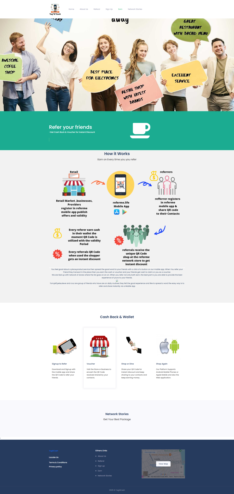
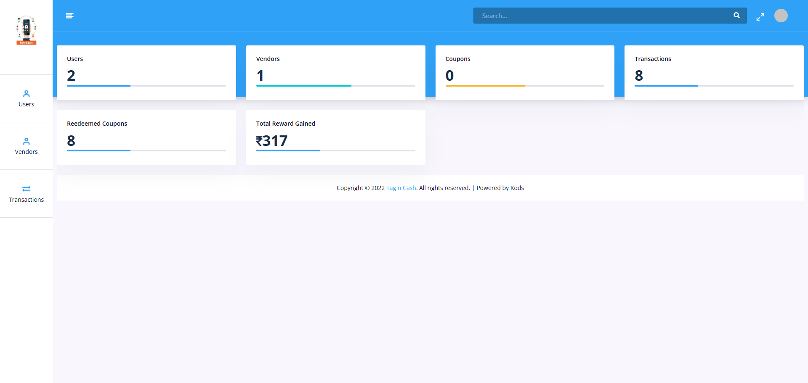
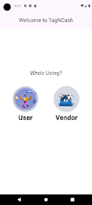
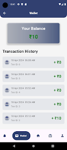
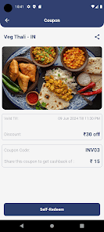
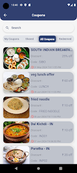
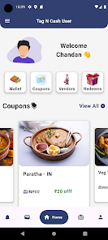

# TagNCash-Web - Referral Rewards Platform

## Overview
TagNCash-Web is the frontend-focused web version of a Laravel-based referral rewards platform, enabling users to share business recommendations (e.g., stores, restaurants) and earn cashback or vouchers when referred friends transact. Built with Laravel for dynamic interactions, it integrates Sendgrid for email notifications, Razorpay for payments, and QR code-based referrals, prioritizing responsive UI/UX. Part of the TagNCash ecosystem, this project showcases my skills in crafting user-centric web applications with secure API integrations, complementing my portfolio projects like SecretHairCare and Samruddhi.

## Screenshots
Below are snapshots of TagNCash-Web’s key features:


*Share QR codes to refer friends and earn rewards.*


*Track referrals, rewards, and transaction history.*


*Browse partnered businesses for shopping and dining using mobile app.*


*Browse partnered businesses for shopping and dining using mobile app.*


*Browse partnered businesses for shopping and dining using mobile app.*


*Browse partnered businesses for shopping and dining using mobile app.*


<!-- *Browse partnered businesses for shopping and dining using mobile app.* -->
<!--  -->

<!-- *Browse partnered businesses for shopping and dining using mobile app.* -->


<!-- *Browse partnered businesses for shopping and dining using mobile app.* -->

## Features
- **Referral System**: Share QR codes via web interface to refer friends, earning rewards.
- **Cashback & Wallet**: View and manage cash or voucher rewards.
- **Email Notifications**: Send referral invites and transaction updates via Sendgrid.
- **Network of Stores**: Browse partnered businesses for shopping and dining.
- **Responsive UI**: Dynamic, mobile-friendly interface with Bootstrap.
- **User Dashboard**: Track referrals and rewards.
- **Transaction Security**: Validates QR code transactions.

## Tech Stack
- **Backend**: Laravel
- **Frontend**: Blade templates, Bootstrap, HTML, CSS, JavaScript
- **Database**: MySQL
- **Integrations**: Sendgrid (email), Razorpay (payments), QR code generation
- **Server**: Apache/Nginx

## Mobile Version 
- **https://play.google.com/store/apps/details?id=com.user.tagncash&pcampaignid=web_share**

## Prerequisites
- PHP >= 8.0
- Composer
- MySQL
- Node.js & NPM
- Sendgrid and Razorpay API keys

## Installation
1. **Clone the Repository**:
   ```bash
   git clone https://github.com/ravirajladha/TagNCash-Web.git
   cd TagNCash-Web
   ```
   On Windows:
   ```powershell
   git clone https://github.com/ravirajladha/TagNCash-Web.git
   cd TagNCash-Web
   ```
2. **Install Dependencies**:
   ```bash
   composer install
   npm install
   ```
3. **Configure Environment**:
   - Copy `.env.example` to `.env`:
     ```bash
     copy .env.example .env
     ```
   - Update `.env` with database, Sendgrid, and Razorpay settings:
     ```
     DB_CONNECTION=mysql
     DB_HOST=127.0.0.1
     DB_PORT=3306
     DB_DATABASE=tagncash_web
     DB_USERNAME=root
     DB_PASSWORD=
     SENDGRID_API_KEY=your_sendgrid_key
     RAZORPAY_KEY=your_key
     RAZORPAY_SECRET=your_secret
     ```
4. **Generate Application Key**:
   ```bash
   php artisan key:generate
   ```
5. **Run Migrations**:
   ```bash
   php artisan migrate
   ```
6. **Seed the Database** (optional):
   ```bash
   php artisan db:seed
   ```
   Populates sample users and stores.
7. **Link Storage**:
   ```bash
   php artisan storage:link
   ```
8. **Compile Frontend Assets**:
   ```bash
   npm run dev
   ```
9. **Start the Server**:
   ```bash
   php artisan serve
   ```
   Access at `http://localhost:8000`.

## Using .gitignore
- The `.gitignore` file excludes sensitive files (e.g., `.env`, logs, uploads).
- Apply it:
  ```bash
  git add .gitignore
  git commit -m "Add .gitignore"
  ```
  On Windows:
  ```powershell
  git add .gitignore
  git commit -m "Add .gitignore"
  ```
- Remove tracked sensitive files:
  ```bash
  git rm --cached .env
  git rm --cached storage/app/public/*.jpg
  git commit -m "Remove sensitive files"
  ```

## Demo
Explore TagNCash-Web’s features through a demo series: [TagNCash-Web Demo Series](https://www.youtube.com/playlist?list=YOUR_PLAYLIST_ID)  
Videos cover:
1. Navigating the responsive UI
2. Sharing QR code referrals
3. Sending email notifications via Sendgrid
4. Viewing cashback rewards

## Testing
- Run Laravel tests:
  ```bash
  php artisan test
  ```
- Manually test UI interactions, email notifications, referrals, and reward tracking.

## Contributions
- **Frontend**: Developed dynamic UI for seamless interactions.
- **Email Integration**: Added Sendgrid for referral invites and transaction updates, secured with `.env`.
- **Referrals**: Enhanced QR code sharing for web users.
- **UX**: Designed responsive layouts for improved engagement.

## Security Notes
- Ensure `.env` is in `.gitignore` to avoid exposing credentials (e.g., Sendgrid, Razorpay keys).
- Sanitize code for sensitive data (e.g., no real user data).
- Scan for secrets before pushing:
  ```bash
  docker run -it --rm -v "$(pwd):/pwd" trufflesecurity/trufflehog git file:///pwd
  ```
  On Windows (with Docker Desktop):
  ```powershell
  docker run -it --rm -v "$($PWD.Path):/pwd" trufflesecurity/trufflehog git file:///pwd
  ```
- Validate file uploads:
  ```php
  $request->validate(['image' => 'required|image|mimes:jpg,png,jpeg|max:2048']);
  ```
- Rotate exposed API keys (e.g., Sendgrid key previously hardcoded).

## License
This project is licensed under the MIT License. See the [LICENSE](LICENSE) file for details.

## Contact
For questions or feedback, reach out to [Ravi Raj Ladha](mailto:ravirajladha@gmail.com).